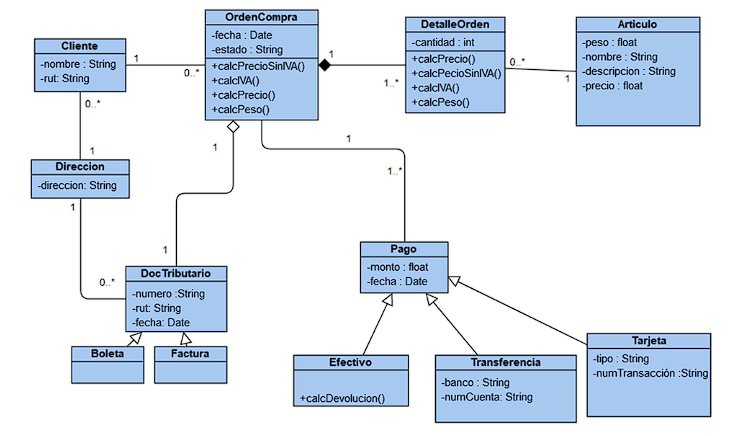
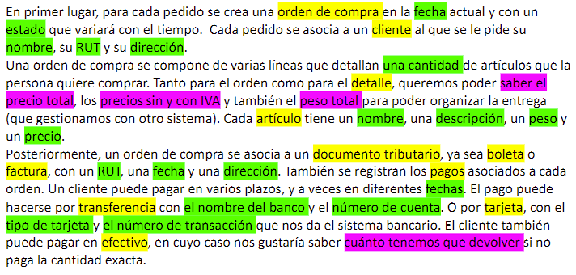

<h3 align="center"> TAREA 1 DE PROGRAMACIÓN 2 (2022-2) (S1 2022)</h3>

  </a>
    
  </a>

### Equipo
* Alonso Isaias Bustos Espinoza (Usuario de github Ado-do)
* Lirayen Maria Martinez Kramm (Usuario de github liraa011)
* Luciano Hernan Argomedo Solis (Usuario de github Kano10)

### Enunciado

  </a>
    
  </a>

### Material
* [UML](https://elvex.ugr.es/decsai/java/pdf/3C-Relaciones.pdf)
